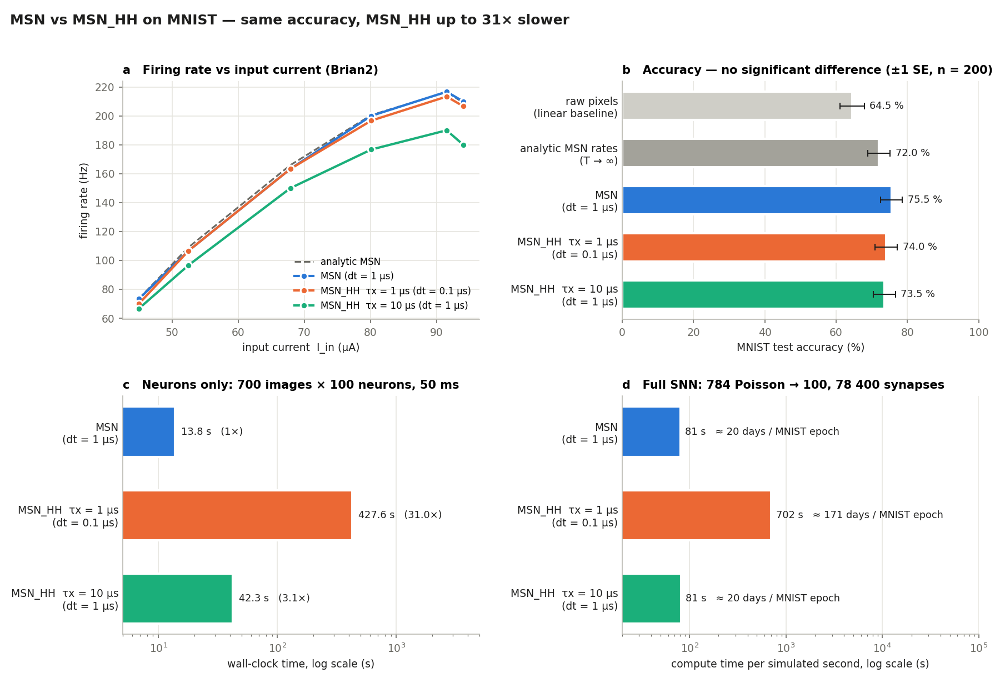

# MNIST test — MSN vs MSN_HH (bistable gate)

**Question.** On an ML task (MNIST), does the gated MSN_HH model of
[`docs/MSN_HH_GATE_PLAN.md`](../docs/MSN_HH_GATE_PLAN.md) *perform* better than
the discrete MSN? And how much longer does it take to simulate?

| File | Content |
|---|---|
| [`msn_bistable.py`](msn_bistable.py) | Brian2 factory `make_msn_bistable` for the Stage-2 gate. It uses the same inlets and spike event as `make_msn`. |
| [`bench_mnist.py`](bench_mnist.py) | The benchmark (Parts 0 / A / B below) |
| `results.json` | Output of the run reported here (console log in `results.log`, git-ignored) |
| [`plot_results.py`](plot_results.py) | Draws `mnist_results.png` from `results.json` |

| `data/` | MNIST, downloaded by torchvision (git-ignored) |

Run it with `uv run python MNIST_test/bench_mnist.py`. It takes about 10 min
on 16 cores with the Cython backend.

**Setup.**
- **Parameters:** hardware-fit (`configs/neuron_hardware_fit.json`).
- **Network:** 784 pixels → 100 hidden neurons through a fixed random
  projection, then a ridge-regression readout on the hidden spike counts.
- **Fair comparison:** weights, images and readout are identical for every
  model, so only the neuron model differs.
- **Models compared:**

| Model | Gate | dt |
|---|---|---|
| MSN | discrete switch (`msn_neuron.make_msn`) | 1 µs |
| MSN_HH, fast | τx = 1 µs gate, k_V = 5 mV, k_I = 0.5 µA | 0.1 µs (needed to resolve the gate) |
| MSN_HH, cheap | τx = 10 µs gate, k_V = 20 mV, k_I = 2 µA | 1 µs |

---

## Part 0 — sanity: firing rate (Hz) in Brian2

| I_in (µA) | 45 | 52.5 | 67.9 | 80.1 | 91.5 | 94 |
|---|---:|---:|---:|---:|---:|---:|
| analytic MSN | 74 | 109 | 166 | 200 | 216 | 209 |
| MSN (discrete) | 73 | 107 | 163 | 200 | 217 | 210 |
| MSN_HH τx = 1 µs | 70 | 107 | 163 | 197 | 213 | 207 |
| MSN_HH τx = 10 µs | 67 | 97 | 150 | 177 | 190 | 180 |

The Brian2 MSN_HH reproduces the NumPy prototype. The fast gate stays within
4 Hz of the discrete model. The cheap gate runs 5–15 % slow.

## Part A — accuracy (current-driven, 500 train / 200 test, 50 ms per image)

Each image sets a constant input current per hidden neuron,
`I = 60 µA + 15 µA·z`. This spans silent, firing and depolarisation-blocked
neurons. All 700 × 100 neurons are simulated in parallel.

| Features | Test accuracy | Wall time | Mean rate |
|---|---:|---:|---:|
| raw pixels (linear baseline) | 64.5 % | — | — |
| analytic MSN rates (T → ∞) | 72.0 % | — | — |
| **MSN (discrete)** | **75.5 %** | **13.8 s** | 119 Hz |
| MSN_HH τx = 1 µs | 74.0 % | 427.6 s (**31×**) | 117 Hz |
| MSN_HH τx = 10 µs | 73.5 % | 42.3 s (3.1×) | 107 Hz |

**Accuracy: no meaningful difference.** With 200 test images, one standard
error is about ±3 %. The spread between the models (73.5–75.5 %, i.e. 4 test
images) is noise. All three MSN variants beat the linear pixel baseline. That
gain comes from the neuron nonlinearity (rheobase plus depolarisation block),
which the models share.

## Part B — cost of a full spiking network (784 Poisson → 100, 78 400 alpha synapses)

This uses Poisson pixel input at up to 63.75 Hz and the repository's
`make_synapse` alpha cascade. 20 ms were simulated, and the numbers are
extrapolated to one MNIST epoch (60 000 images × 350 ms).

| Model | Wall-clock per simulated second | One epoch |
|---|---:|---:|
| MSN (discrete, dt = 1 µs) | 81 s | ≈ 20 days |
| MSN_HH τx = 1 µs (dt = 0.1 µs) | 702 s (**8.7×**) | ≈ 171 days |
| MSN_HH τx = 10 µs (dt = 1 µs) | 81 s (1.0×) | ≈ 20 days |

---

## Conclusions

1. **Performance: a tie.** Both models present the same firing-rate curve to
   the network, so MNIST accuracy is the same within noise. The gate adds
   physical detail (switching kinetics), not computational power.
2. **Cost: MSN_HH is always at least as slow, and up to 31× slower.** Two
   separate factors add up:
   - **Timestep.** A gate as fast as the hardware (≤ 1 µs) needs dt = 0.1 µs,
     which means 10× more steps.
   - **Per-step work.** The gate adds an extra ODE with two exponentials,
     about 3× the cost per neuron-step (the τx = 10 µs row in Part A).
   - **Neurons only:** the two factors multiply (≈ 31×).
   - **Full network:** the 78 400 synapses dominate the per-step cost, so the
     neuron model barely matters at equal dt (1.0×). The 10× timestep penalty
     still applies (8.7×).
3. **Both are too slow at µs resolution for full-scale MNIST** (≥ 20 days per
   epoch). For ML, train with the discrete MSN's analytic firing-rate curve as
   the activation (the "analytic" row is already competitive), or with
   event-driven exact spike times. Then validate on the spiking MSN. Keep
   MSN_HH for device-physics questions.

**Caveats.**
- These are single-seed runs on small sets (500/200 images). The accuracy
  claim is "no detectable difference", not a ranking.
- The Brian2 warnings about `dt` / `rates` in the log are harmless name
  clashes with local variables. Brian2 uses its internal values.
- Timings are for the Cython backend on this machine (16 cores, WSL2).
