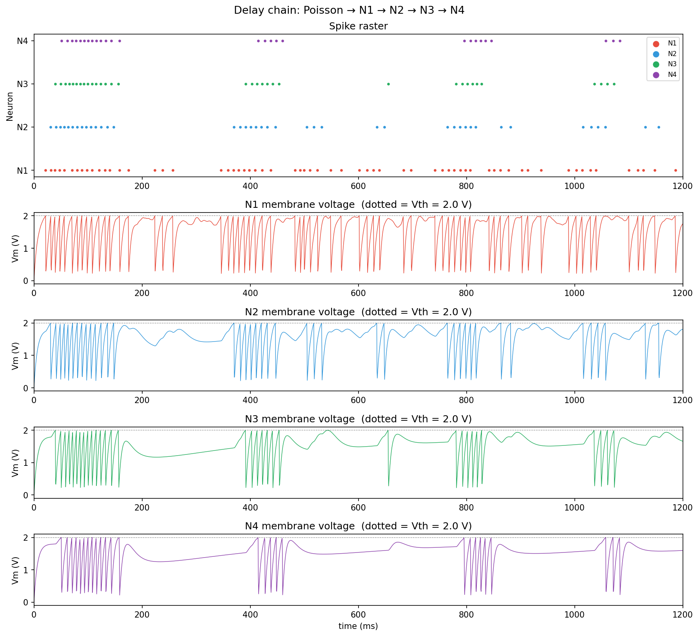
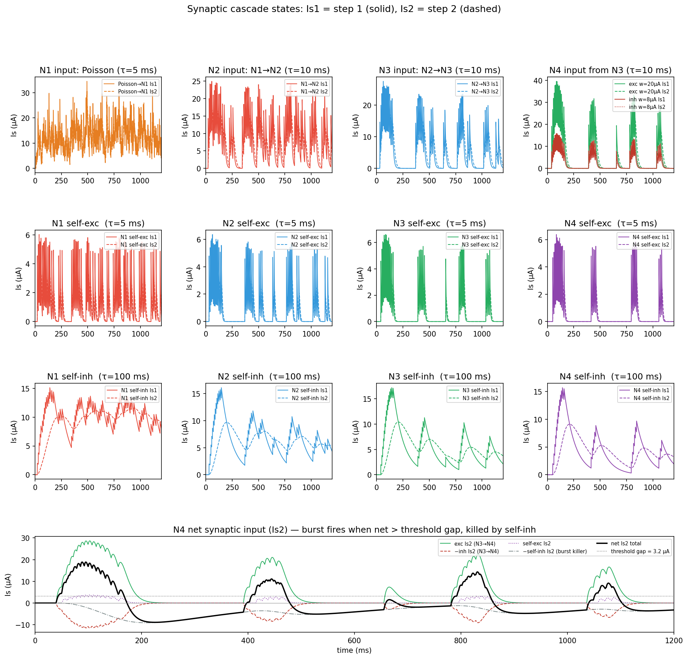

# Brain2simulator — Memristive Spiking Neuron in Brian2

A Brian2 implementation of the Memristive Spiking Neuron (MSN) of Wu et al. 2023 [^1], with a small split library (neuron + synapse) and a worked neuron chain demo.

[^1]: J. Wu, K. Wang, O. Schneegans, P. Stoliar, M. Rozenberg, *Bursting dynamics in a spiking neuron with a memristive voltage-gated channel*, Neuromorph. Comput. Eng. **3**, 044008 (2023).

---

## 1. What this branch contains

```
msn_neuron.py                  MSNParams + make_msn         — neuron module
msn_synapse.py                 SynapseParams + make_synapse — synapse module
msn_variability.py             per-neuron device-variability helper
configs/neuron_default.json    hardware parameters (35-device P0118MA calibration)
configs/synapse_default.json   exc / inh weight + cascade presets
demo/ns_msn_v5_delay_chain.py  4-neuron delay-chain demo (canonical example)
demo/ns_msn_v5_raster_vm.png   demo output: spike raster + Vm traces
demo/ns_msn_v5_synaptic.png    demo output: synaptic cascade states
```

The neuron and synapse modules are deliberately separate so populations and connection types can evolve independently. The synaptic filter cascade lives on the **synapse** (not the neuron), so each connection can have its own time constants.

> Comparison with abstract aLIF / Thyristor models lives on a separate branch.

---

## 2. The model

### 2.1 Physical reference

A two-terminal memristor `M` (a thyristor `T` in parallel with a resistor `R`) sits in series with a load resistor `R_a` between the membrane node `V_m` and ground. A capacitor `C_m` to ground holds the membrane state.

The memristor is a hysteretic two-state device:

- **Open** (`s = 0`): high resistance `R_m^{hi}` (~60 kΩ — the thyristor's effective off-state impedance).
- **Closed** (`s = 1`): low resistance `R_m^{lo}` (~10 Ω — thyristor ≈ short circuit when conducting).
- Open → Closed when `V_m > V_th` (~0.9 V in the paper; **2.0 V** in the calibrated JSON default).
- Closed → Open when the current through `M` drops below a holding current `I_hold` (~77 µA).

The externally observed spike is `V_out = V_m · R_a / (R_m + R_a)` — the voltage across the load resistor.

### 2.2 Equations

$$
C_m \frac{dV_m}{dt} = I_0 + I_{\text{exc}} - I_{\text{inh}} - \frac{V_m}{R_m(s) + R_a}
$$

$$
R_m(s) = (1-s)\,R_m^{\text{hi}} + s\,R_m^{\text{lo}}
$$

`I_exc` and `I_inh` are summed synaptic **inlets** — plain current parameters living on the neuron that each `Synapses` object writes into (§2.3). A neuron can declare several named inlets (one per pathway or receptor type); `make_msn` sums all excitatory inlets and subtracts all inhibitory ones.

| Transition | Condition | Effect |
|---|---|---|
| Open → Closed | `Vm > Vth and s = 0` | `s ← 1`; emits a Brian2 spike |
| Closed → Open | `I_M < I_hold and s = 1` | `s ← 0` |

`V_m` is **not reset** at the close event. The "spike" is the natural fast discharge of `C_m` through `R_m^{lo} + R_a` while `s = 1`. This produces a real voltage waveform whose width is set by the circuit:

$$
\tau_{\text{close}} = C_m\,(R_m^{\text{lo}} + R_a)
$$

### 2.3 Synaptic cascade

The synaptic filter lives **on the `Synapses` object**, not the neuron — so every connection can have its own kinetics (the biological AMPA / NMDA / GABA picture). Each pre-synaptic spike adds an instantaneous kick of the per-edge weight `w` to a first-stage current `I_{s1}`, which drives a second-stage current `I_{s2}` through a passive cascade:

$$
\tau_{s1}\frac{dI_{s1}}{dt} = -I_{s1} + w \sum_{t_k}\delta(t-t_k)
\qquad
\tau_{s2}\frac{dI_{s2}}{dt} = -I_{s2} + I_{s1}
$$

The synapse writes `I_{s2}` into a named inlet on the target via Brian2's `(summed)` mechanism (`<target_var>_post = Is2`). With `cascade='alpha'` and `τ_s1 = τ_s2 = τ_s`, one pre-spike yields the alpha function `(w/τ_s)·t·e^{-t/τ_s}`, peaking at `w/e ≈ 0.37·w` at `t = τ_s`. Under continuous Poisson drive at rate λ (with `λ·τ_s ≫ 1`) the steady-state mean is `⟨I_{s2}⟩ ≈ w·λ·τ_s`. A faster, sharper response is available with `cascade='exp'` (single exponential — `I_{s2}` is dropped).

> **One writer per inlet.** Brian2 allows only one `Synapses` object to write a given `(inlet, group)` pair via `(summed)`. When several pathways of the same sign converge on one neuron, give each its own named inlet (e.g. `I_exc_poisson`, `I_exc_self`) — see §4.1.

### 2.4 Hardware and derived quantities

Defaults are calibrated to a 35-device P0118MA thyristor dataset (Dec 2025), stored in [configs/neuron_default.json](configs/neuron_default.json):

| Symbol | Default | Description |
|---|---:|---|
| `Cm` | 0.1 µF | membrane capacitor (100 nF) |
| `Ra` | 2.2 kΩ | load resistor |
| `Rm_hi` | 60 kΩ | open-state memristor (effective off-state impedance) |
| `Rm_lo` | 10 Ω | closed-state memristor (thyristor ≈ short) |
| `Vth` | 2.0 V | close threshold — a per-neuron state variable |
| `I_hold` | 77 µA | holding current — a per-neuron state variable |

Synaptic time constants `tau_s1` / `tau_s2` live on each synapse (`SynapseParams`), not the neuron — see §4.2.

| Derived | Formula | Value |
|---|---|---:|
| Rheobase | `I_min = Vth / (Rm_hi + Ra)` | ~32 µA |
| Depol-block onset | `I_max = I_hold` | 77 µA |
| Open-state τ | `τ_open = Cm·(Rm_hi + Ra)` | ~6.2 ms |
| Closed-state τ (spike width) | `τ_close = Cm·(Rm_lo + Ra)` | ~0.22 ms |

Tonic-bias regimes (set per neuron after construction with `G.I_0 = …`):

| Regime | Behaviour |
|---|---|
| `I_0 ∈ (0, I_min)` | silent; needs synaptic input to fire |
| `I_0 ∈ (I_min, I_max)` | spontaneously firing |
| `I_0 > I_max` | latched closed → depolarisation block |

---

## 3. Getting started on macOS (step by step)

A from-zero setup guide. Follow it top to bottom — every command is copy-paste-able. Inside the code blocks, a line starting with `#` is just an explanatory comment; you don't type it. Already comfortable with the tools? Skip to §3.8.

### 3.1 Open the Terminal

The Terminal is the app where you type commands.

1. Press `⌘ Cmd` + `Space` to open Spotlight search.
2. Type `Terminal` and press `Return`.
3. A window opens with a prompt ending in `%` (macOS's default shell is **zsh**). You type a command after the `%` and press `Return` to run it.

### 3.2 Install Homebrew (the macOS package manager)

**Homebrew** installs developer tools for you with one command each. Paste this into the Terminal and press `Return`:

```bash
/bin/bash -c "$(curl -fsSL https://raw.githubusercontent.com/Homebrew/install/HEAD/install.sh)"
```

- It asks for your Mac login password (as you type, nothing appears on screen — that's normal) and may ask you to press `Return` to continue.
- When it finishes it prints a **"Next steps"** box. On **Apple Silicon Macs (M1/M2/M3/M4)** you must run the two lines it shows to put Homebrew on your PATH:

```bash
echo 'eval "$(/opt/homebrew/bin/brew shellenv)"' >> ~/.zprofile
eval "$(/opt/homebrew/bin/brew shellenv)"
```

(On older **Intel Macs** Homebrew lives under `/usr/local` and usually needs no PATH step.)

Check it works:

```bash
brew --version      # should print "Homebrew 4.x.x"
```

### 3.3 Install Git, uv, and VS Code

Use Homebrew to install the three things this project needs:

```bash
brew install git uv                          # git = downloads the code; uv = Python + package manager
brew install --cask visual-studio-code       # the code editor
```

Check the command-line tools installed:

```bash
git --version       # e.g. git version 2.4x.x
uv --version        # e.g. uv 0.x.x
```

> **You do not need to install Python yourself.** `uv` automatically downloads the exact Python version this project requires (3.12) in the next steps.

### 3.4 Download the project

Choose a folder to keep your code in, then "clone" (download) the repository into it:

```bash
cd ~/Documents                                              # go to your Documents folder
git clone https://github.com/haoran215/Brain2Simulator.git  # download the project
cd Brain2Simulator                                          # move into the project folder
```

You're now inside the project. Run `ls` to confirm — you should see `README.md`, `msn_neuron.py`, `configs/`, `demo/`, and more.

### 3.5 Install the dependencies

One command creates an isolated Python environment and installs the exact library versions (brian2, matplotlib, numpy) the project is pinned to:

```bash
uv sync
```

This creates a hidden `.venv` folder inside the project and downloads Python 3.12 if you don't already have it. You only do this once (re-run it later if the project's dependencies change).

### 3.6 Open the project in VS Code

```bash
code .       # opens the current folder (the ".") in VS Code
```

(If you get `code: command not found`, open VS Code from Launchpad, then press `⌘ Cmd`+`⇧ Shift`+`P`, type `Shell Command: Install 'code' command in PATH`, press `Return`, and run `code .` again.)

With VS Code open:

1. **Install the Python extension.** VS Code usually shows a popup offering it — click **Install**. Otherwise open the Extensions panel (`⌘ Cmd`+`⇧ Shift`+`X`), search for **Python** (publisher: Microsoft), and install it.
2. **Select the interpreter** so VS Code uses the environment `uv` just built: press `⌘ Cmd`+`⇧ Shift`+`P`, type `Python: Select Interpreter`, press `Return`, and choose the entry whose path contains `.venv` (often marked *Recommended*).

### 3.7 Run the demo

Open VS Code's built-in terminal with `Ctrl`+`` ` `` (the backtick key, top-left of the keyboard), then run:

```bash
uv run python demo/ns_msn_v5_delay_chain.py
```

`uv run` executes the script inside the project's environment. You'll see a text progress report; when it finishes it writes two images into the `demo/` folder:

- `demo/ns_msn_v5_raster_vm.png`
- `demo/ns_msn_v5_synaptic.png`

Open either file from VS Code's file explorer (left sidebar) to view it. If the images appear, your environment is fully working. 🎉

### 3.8 Quick install (experienced users)

```bash
uv sync                                       # installs brian2, matplotlib, numpy into .venv
uv run python demo/ns_msn_v5_delay_chain.py   # writes the PNGs into demo/
```

Brian2 falls back to its NumPy backend without a C++ compiler, and the demo sets `prefs.codegen.target = 'numpy'` explicitly. For the faster Cython backend, install Apple's compiler with `xcode-select --install` and remove that line from the script.

### 3.9 Troubleshooting

| Symptom | Fix |
|---|---|
| `zsh: command not found: brew` | The PATH step in §3.2 didn't run. Re-run the two `echo`/`eval` lines, then close and reopen the Terminal. |
| `command not found: uv` | Run `brew install uv`, then reopen the Terminal. |
| `code: command not found` | In VS Code: `⌘⇧P` → `Shell Command: Install 'code' command in PATH`. |
| VS Code uses the wrong Python / `ModuleNotFoundError: brian2` | Re-select the `.venv` interpreter (§3.6 step 2), or just run scripts with `uv run python …` in the terminal. |
| `"Visual Studio Code" cannot be opened` on first launch | Right-click the app → **Open**, or allow it in **System Settings → Privacy & Security**. |
| Brian2 warns about no C++ compiler | Harmless — it uses the NumPy backend. For speed, run `xcode-select --install`. |

---

## 4. Public API

### 4.1 Neuron — `msn_neuron.py`

```python
from msn_neuron import MSNParams, make_msn

params  = MSNParams.from_json('configs/neuron_default.json')  # or MSNParams() for the same calibrated defaults
neurons = make_msn(N=20, params=params, name='pop')           # default inlets: one 'I_exc', one 'I_inh'
neurons.I_0 = 18e-6 * amp                  # scalar — same for all
# neurons.I_0 = np.array([...]) * amp      # or per-neuron

# Several named inlets (one Synapses writer per inlet — see §2.3):
pop = make_msn(N=20, params=params,
               exc_inlets=('I_ampa', 'I_nmda'),
               inh_inlets=('I_gaba',), name='pop2')
```

`MSNParams` is a dataclass holding the six hardware values `Cm, Ra, Rm_hi, Rm_lo, Vth, I_hold`. Helpers: `I_gt` (rheobase), `operating_window() → (I_min, I_max)`, `time_constants() → (τ_open, τ_close)`, `summary()`, plus `from_json` / `to_json`.

`make_msn(N, params, exc_inlets=('I_exc',), inh_inlets=('I_inh',), name)` returns a `NeuronGroup`. Each inlet name becomes a summed-current state variable that **exactly one** `Synapses` object may write. State variables:

| Variable | Meaning |
|---|---|
| `Vm`, `Vout`, `I_M`, `Rm_S` | circuit quantities |
| `s` | memristor state (0 = open, 1 = closed) |
| `I_0` | per-neuron tonic bias [A] |
| `Vth`, `I_hold` | per-neuron threshold / holding current (enable device variability) |
| `<exc_inlets>` | excitatory synaptic inlets [A] (default `I_exc`) |
| `<inh_inlets>` | inhibitory synaptic inlets [A] (default `I_inh`) |

> `Vth` / `I_hold` are per-neuron so `msn_variability.apply_variability(G)` can draw them from the measured device distribution.

### 4.2 Synapse — `msn_synapse.py`

```python
from msn_synapse import SynapseParams, make_synapse

inh_params = SynapseParams.from_json('configs/synapse_default.json', key='inh')
syn = make_synapse(source=N1, target=N2, params=inh_params,
                   connect=True, name='syn_N1_N2')   # writes N2's I_inh inlet
```

`SynapseParams` holds intrinsic synapse properties only (topology is **not** stored — pass it to `make_synapse` as `connect=`):

| Field | Meaning |
|---|---|
| `weight` | per-edge kick `w` added to `Is1` on each pre-spike [A] |
| `kind` | `'exc'` or `'inh'` — sets the default inlet and its sign |
| `tau_s1`, `tau_s2` | cascade time constants [s] |
| `cascade` | `'alpha'` (2-stage `Is1→Is2`) or `'exp'` (single exponential) |
| `delay` | transmission delay [s] |
| `target_var` | explicit inlet name on the target; defaults to `I_exc` / `I_inh` |

`make_synapse(source, target, params, connect='i == j', name)` returns a Brian2 `Synapses` object that carries its **own** cascade state `Is1`, `Is2` plus a per-edge weight `w : amp`, addressable for plasticity:

```python
syn.w = 10e-6 * amp                 # uniform
syn.w = np.random.normal(...) * amp # heterogeneous
syn.w['i==0'] = 20e-6 * amp         # subset
```

To send two pathways of the same sign into one neuron, declare a named inlet for each and point its synapse at it (each with its own kinetics):

```python
pop = make_msn(N=10, exc_inlets=('I_ampa', 'I_nmda'), name='pop')
make_synapse(src, pop, SynapseParams(kind='exc', tau_s1=2e-3,  tau_s2=5e-3,   target_var='I_ampa'), name='ampa')
make_synapse(src, pop, SynapseParams(kind='exc', tau_s1=50e-3, tau_s2=100e-3, target_var='I_nmda'), name='nmda')
```

Common `connect` patterns:

| `connect=` | Topology |
|---|---|
| `'i == j'` | one-to-one (and self-loops if `src is tgt`) |
| `'i != j'` | all-to-all, no self-loops |
| `True` | all-to-all including self-loops |
| `'rand() < 0.1'` | random sparse |
| `'abs(i-j) <= 2 and i != j'` | local band on a ring |

---

## 5. Walkthrough — the delay-chain demo

[demo/ns_msn_v5_delay_chain.py](demo/ns_msn_v5_delay_chain.py) builds a four-neuron feed-forward chain that produces **self-terminating bursts**:

```
Poisson ─(exc)─► N1 ─(exc)─► N2 ─(exc)─► N3 ─(exc)─► N4
                                              └─(inh)─┘
```

Every neuron carries a **fast self-excitatory** loop (sustains a burst once it starts) and a **slow self-inhibitory** loop (accumulates and ends the burst). The annotated walkthrough below mirrors the script.

### 5.1 Backend and clock

```python
from brian2 import *
prefs.codegen.target = 'numpy'   # remove if you have a C++ compiler (xcode-select --install)
defaultclock.dt = 10 * us        # resolves τ_close ≈ 0.22 ms
```

`dt` must resolve `τ_close`; 10 µs is comfortable for the calibrated parameters.

### 5.2 Parameters

```python
from msn_neuron  import MSNParams,    make_msn
from msn_synapse import SynapseParams, make_synapse

p    = MSNParams()              # calibrated defaults (or MSNParams.from_json('configs/neuron_default.json'))
I_gt = p.I_gt                   # rheobase ≈ 32 µA
print(p.summary())
```

`MSNParams()` already carries the 35-device calibration; `from_json` loads the identical values from version control.

### 5.3 Define the neurons and their inlets

Each neuron declares one named inlet per incoming pathway, because Brian2 allows only one `Synapses` writer per inlet (§2.3):

```python
start_scope()

N1 = make_msn(1, params=p, exc_inlets=('I_exc_poisson', 'I_exc_self'),
                           inh_inlets=('I_inh_self',),                name='N1')
N2 = make_msn(1, params=p, exc_inlets=('I_exc_n1', 'I_exc_self'),
                           inh_inlets=('I_inh_self',),                name='N2')
N3 = make_msn(1, params=p, exc_inlets=('I_exc_n2', 'I_exc_self'),
                           inh_inlets=('I_inh_self',),                name='N3')
N4 = make_msn(1, params=p, exc_inlets=('I_exc_n3', 'I_exc_self'),
                           inh_inlets=('I_inh_n3', 'I_inh_self'),     name='N4')
```

N1–N3 each take one chain input plus a self-exc and a self-inh inlet; N4 additionally receives an inhibitory input from N3.

### 5.4 Tonic bias

Each neuron is biased **just below** rheobase, so it stays silent until synaptic input tips it over:

```python
N1.I_0 = 0.95 * I_gt * amp                      # Poisson + self-exc push it over
N2.I_0 = N3.I_0 = N4.I_0 = 0.90 * I_gt * amp
```

### 5.5 Drives and synapses

A `PoissonGroup` drives N1; chain links carry the signal forward; per-neuron self-loops shape each burst. Every connection is an alpha cascade with its own `weight` and `tau`:

```python
poisson_src = PoissonGroup(1, rates=500*Hz)

def alpha(src, tgt, kind, w, tau, target_var, name):
    return make_synapse(src, tgt,
        params=SynapseParams(kind=kind, weight=w, tau_s1=tau, tau_s2=tau,
                             cascade='alpha', target_var=target_var),
        connect=(True if src is poisson_src else 'i == j'), name=name)

# chain: Poisson → N1 → N2 → N3, then N3 → N4 (exc + weaker inh)
alpha(poisson_src, N1, 'exc', 5e-6,  5e-3,  'I_exc_poisson', 'syn_poisson_n1')
alpha(N1, N2,          'exc', 15e-6, 10e-3, 'I_exc_n1',      'syn_n1_n2')
alpha(N2, N3,          'exc', 15e-6, 10e-3, 'I_exc_n2',      'syn_n2_n3')
alpha(N3, N4,          'exc', 20e-6, 10e-3, 'I_exc_n3',      'syn_n3_n4_exc')
alpha(N3, N4,          'inh', 8e-6,  10e-3, 'I_inh_n3',      'syn_n3_n4_inh')

# per-neuron self-loops (shown for N1; repeat for N2..N4)
syn_n1_self_exc = alpha(N1, N1, 'exc', 5e-6, 5e-3,   'I_exc_self', 'syn_n1_self_exc')  # fast — sustains
syn_n1_self_inh = alpha(N1, N1, 'inh', 2e-6, 100e-3, 'I_inh_self', 'syn_n1_self_inh')  # slow — ends burst
```

The self-inhibition is **20× slower** than the self-excitation, so each burst sustains for ~160 ms while the self-inhibitory synapse's `Is2` accumulates, then is pulled back below threshold for ~100 ms before the next cycle.

### 5.6 Monitors

```python
spk = [SpikeMonitor(N) for N in (N1, N2, N3, N4)]
vm  = [StateMonitor(N, 'Vm', record=True, dt=0.5*ms) for N in (N1, N2, N3, N4)]
sm  = StateMonitor(syn_n1_self_inh, ['Is1', 'Is2'], record=True, dt=0.5*ms)
```

`SpikeMonitor` records the threshold events (output spikes); `StateMonitor` records continuous traces. Because the cascade now lives on the synapse, you record `Is1`/`Is2` from the **synapse** object, not the neuron.

### 5.7 Run

```python
net = Network(collect())
net.run(1200 * ms, report='text')
```

This demo builds an explicit `Network(collect())`. With a single top-level `start_scope()` you could equally call `run()` directly.

### 5.8 Result

Two figures are written into `demo/`:

**Raster + membrane voltages** — the chain fires in sequence (N1→N2→N3→N4, ~8 ms per stage) and each neuron bursts then falls silent:



**Synaptic cascade states** — `Is1` (step 1) and `Is2` (step 2) for every connection. The slow self-inhibitory `Is2` (τ = 100 ms) is the build-up that terminates each burst; the bottom panel sums N4's inlets against its threshold gap:



---

## 6. Tuning notes

### 6.1 Choosing `τ_s`

`τ_s` should be comparable to the target inter-spike interval:

- `τ_s ≪ ISI`: spike-like blips, no integration.
- `τ_s ~ ISI`: integration window matches the firing timescale.
- `τ_s ≫ ISI`: smooth low-pass — effectively a DC offset.

`tau_s1` / `tau_s2` are set **per synapse** in `SynapseParams` (library default 200 ms). The delay-chain demo mixes scales deliberately — 5 ms self-excitation to sustain a burst, 100 ms self-inhibition to end it (§5.5).

### 6.2 Trigger inequality

To push a subthreshold neuron over `I_min` with one pre-synaptic spike (an alpha cascade peaks at `w/e`):

$$
w > e \cdot (I_{\min} - I_0)
$$

### 6.3 Sustain inequality

For a self-excitatory (or recurrent) edge of weight `w` and steady firing rate `f`, the cumulative `Is2` settles near `w·f·τ_s`. Compare to `I_min - I_0`:

- `w·f·τ_s > I_min - I_0` → latched, persistent firing.
- `w·f·τ_s < I_min - I_0` → transient bump that fades.

This is exactly the balance the delay-chain demo exploits: fast self-excitation sits *above* this line (sustaining the burst) while slow self-inhibition grows until the **net** drive falls below it, ending the burst.

---

## 7. Limitations and planned extensions

1. **Linear closed-state `R_m`.** The real thyristor on-state has a near-constant forward voltage `V_on ≈ 0.65 V` plus small dynamic resistance; the two-state linear `R_m` gives an exponential decay rather than a constant-V plateau. Replacing `R_m^{lo}` with a clipped diode model `V_M = V_on + I_M · R_m^{lo}` would close most of the spike-shape gap with the paper's Fig. 2.

2. **No plasticity yet.** `make_synapse` already exposes per-edge `w`. Adding STDP requires only trace variables in the `Synapses` model and a pre/post update rule. The `Is1`/`Is2` cascade already acts as an eligibility trace — its slow integration provides the temporal coincidence window an STDP rule needs. The long-term goal is to implement `I_w` as the resistance of a non-volatile memristive device:

   | Role | Memristor type | Behaviour |
   |---|---|---|
   | Neuron (`R_m`) | Volatile / threshold-switching | Snaps to `R_m^{lo}` at `Vth`; resets at `I_M < I_hold` |
   | Synapse (`I_w`) | Non-volatile (filamentary, PCM, FeFET) | Resistance encodes the learned weight |

3. **No *intrinsic* bursting.** The delay-chain demo produces bursts at the **network** level (slow synaptic self-inhibition), but the single-neuron circuit itself cannot burst. Wu et al. §3 (the MSBN) adds a second compartment `R_s, C_s` in place of the ground reference at the bottom of `M`, generating four intrinsic spiking modes (TS, FS, IB1, IB2). This is the next architectural extension.

4. **Per-edge synaptic heterogeneity.** `tau_s1` / `tau_s2` are namespace constants on each `Synapses` object (shared across its edges). Promoting them to per-edge state variables would allow heterogeneous kinetics within one connection. (Per-*neuron* device variability in `Vth` / `I_hold` is already supported via `msn_variability`.)

---

## Appendix. Reproducibility

`defaultclock.dt = 10 µs`, `method='euler'`, `seed(42)`. State recording uses `dt = 0.5 ms` for the delay-chain demo to keep memory bounded. The figures are regenerated by running `demo/ns_msn_v5_delay_chain.py` directly.
