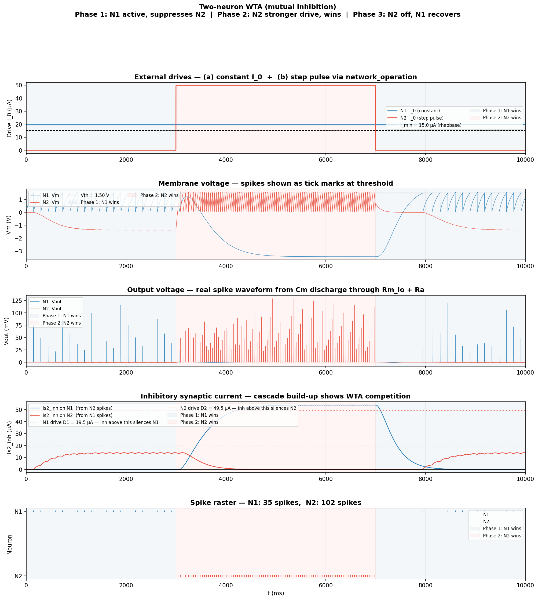

# Brain2simulator — Memristive Spiking Neuron in Brian2

A Brian2 implementation of the Memristive Spiking Neuron (MSN) of Wu et al. 2023 [^1], with a small split library (neuron + synapse) and a worked two-neuron Winner-Take-All demo.

[^1]: J. Wu, K. Wang, O. Schneegans, P. Stoliar, M. Rozenberg, *Bursting dynamics in a spiking neuron with a memristive voltage-gated channel*, Neuromorph. Comput. Eng. **3**, 044008 (2023).

---

## 1. What this branch contains

```
msn_neuron.py                MSNParams + make_msn   — neuron module
msn_synapse.py               SynapseParams + make_synapse — synapse module
configs/neuron_default.json  Wu et al. Fig. 2 hardware parameters
configs/synapse_default.json exc / inh weight presets
ns_msn_wta_demo.py           Two-neuron WTA demo (canonical example)
ns_msn_wta_demo.png          WTA demo output figure
```

The neuron and synapse modules are deliberately separate so populations and connection types can evolve independently.

> Comparison with abstract aLIF / Thyristor models lives on a separate branch.

---

## 2. The model

### 2.1 Physical reference

A two-terminal memristor `M` (a thyristor `T` in parallel with a resistor `R`) sits in series with a load resistor `R_a` between the membrane node `V_m` and ground. A capacitor `C_m` to ground holds the membrane state.

The memristor is a hysteretic two-state device:

- **Open** (`s = 0`): high resistance `R_m^{hi}` (~100 kΩ).
- **Closed** (`s = 1`): low resistance `R_m^{lo}` (~500 Ω).
- Open → Closed when `V_m > V_th` (~0.9 V in the paper, 1.5 V in the JSON default).
- Closed → Open when the current through `M` drops below a holding current `I_hold` (~100 µA).

The externally observed spike is `V_out = V_m · R_a / (R_m + R_a)` — the voltage across the load resistor.

### 2.2 Equations

$$
C_m \frac{dV_m}{dt} = I_0 + I_{s2}^{\text{exc}} - I_{s2}^{\text{inh}} - \frac{V_m}{R_m(s) + R_a}
$$

$$
R_m(s) = (1-s)\,R_m^{\text{hi}} + s\,R_m^{\text{lo}}
$$

| Transition | Condition | Effect |
|---|---|---|
| Open → Closed | `Vm > Vth and s = 0` | `s ← 1`; emits a Brian2 spike |
| Closed → Open | `I_M < I_hold and s = 1` | `s ← 0` |

`V_m` is **not reset** at the close event. The "spike" is the natural fast discharge of `C_m` through `R_m^{lo} + R_a` while `s = 1`. This produces a real voltage waveform whose width is set by the circuit:

$$
\tau_{\text{close}} = C_m\,(R_m^{\text{lo}} + R_a)
$$

### 2.3 Synaptic cascade

Each pre-synaptic spike at neuron *j* adds an instantaneous kick `I_w` to a first-stage current `I_{s1}^{(j)}`, which drives a second-stage current `I_{s2}^{(j)}` through a passive cascade:

$$
\tau_{s1}\frac{dI_{s1}}{dt} = -I_{s1} + I_w \sum_{t_k}\delta(t-t_k)
\qquad
\tau_{s2}\frac{dI_{s2}}{dt} = -I_{s2} + I_{s1}
$$

For `τ_s1 = τ_s2 = τ_s`, one pre-spike yields the alpha function `(I_w/τ_s)·t·e^{-t/τ_s}`, peaking at `I_w/e ≈ 0.37·I_w` at `t = τ_s`. Under continuous Poisson drive at rate λ (with `λ·τ_s ≫ 1`) the steady-state mean is `⟨I_{s2}⟩ ≈ I_w·λ·τ_s`.

The neuron sees `I_syn = I_{s2}^{exc} - I_{s2}^{inh}`.

### 2.4 Hardware and derived quantities

| Symbol | Default | Description |
|---|---:|---|
| `Cm` | 1 µF | membrane capacitor |
| `Ra` | 47 Ω | load resistor |
| `Rm_hi` | 100 kΩ | open-state memristor |
| `Rm_lo` | 500 Ω | closed-state memristor |
| `Vth` | 1.5 V | thyristor close threshold |
| `I_hold` | 100 µA | holding current |
| `tau_s1` / `tau_s2` | 200 ms | synaptic cascade time constants |

| Derived | Formula | Value |
|---|---|---:|
| Rheobase | `I_min = Vth / (Rm_hi + Ra)` | ~15 µA |
| Depol-block onset | `I_max = I_hold` | 100 µA |
| Open-state τ | `τ_open = Cm·(Rm_hi + Ra)` | ~100 ms |
| Closed-state τ (spike width) | `τ_close = Cm·(Rm_lo + Ra)` | ~0.55 ms |

Tonic-bias regimes (set per neuron after construction with `G.I_0 = …`):

| Regime | Behaviour |
|---|---|
| `I_0 ∈ (0, I_min)` | silent; needs synaptic input to fire |
| `I_0 ∈ (I_min, I_max)` | spontaneously firing |
| `I_0 > I_max` | latched closed → depolarisation block |

---

## 3. Install and run

```bash
uv sync                          # installs brian2, matplotlib, numpy
uv run python ns_msn_wta_demo.py # produces ns_msn_wta_demo.png
```

Brian2 falls back to its NumPy backend without a C++ compiler. The demo sets `prefs.codegen.target = 'numpy'` explicitly. To use the (faster) Cython backend, install `build-essential` and remove that line.

---

## 4. Public API

### 4.1 Neuron — `msn_neuron.py`

```python
from msn_neuron import MSNParams, make_msn

params  = MSNParams.from_json('configs/neuron_default.json')
neurons = make_msn(N=20, params=params, name='pop')
neurons.I_0 = 18e-6 * amp                  # scalar — same for all
# neurons.I_0 = np.array([...]) * amp      # or per-neuron
```

`MSNParams` is a dataclass holding the six hardware values plus `tau_s1`, `tau_s2`. Helpers: `operating_window()`, `time_constants()`, `summary()`, plus `from_json` / `to_json`.

`make_msn(N, params, name)` returns a `NeuronGroup` with these state variables:

| Variable | Meaning |
|---|---|
| `Vm`, `Vout`, `I_M`, `Rm_S` | circuit quantities |
| `s` | memristor state (0 = open, 1 = closed) |
| `I_0` | per-neuron tonic bias [A] |
| `Is1_exc`, `Is2_exc` | excitatory cascade [A] |
| `Is1_inh`, `Is2_inh` | inhibitory cascade [A] |

### 4.2 Synapse — `msn_synapse.py`

```python
from msn_synapse import SynapseParams, make_synapse

inh_params = SynapseParams.from_json('configs/synapse_default.json', key='inh')
syn = make_synapse(source=N1, target=N2, params=inh_params,
                   connect=True, name='syn_N1_N2')
```

`SynapseParams` holds intrinsic synapse properties only: `weight` (A), `kind` (`'exc'` or `'inh'`), `delay` (s). Topology is **not** stored — pass it to `make_synapse` as `connect=`.

`make_synapse` returns a Brian2 `Synapses` object with per-edge `w : amp`, addressable for plasticity:

```python
syn.w = 10e-6 * amp                # uniform
syn.w = np.random.normal(...) * amp # heterogeneous
syn.w['i==0'] = 20e-6 * amp        # subset
```

Common `connect` patterns:

| `connect=` | Topology |
|---|---|
| `'i == j'` | one-to-one (and self-loops if `src is tgt`) |
| `'i != j'` | all-to-all, no self-loops |
| `True` | all-to-all including self-loops |
| `'rand() < 0.1'` | random sparse |
| `'abs(i-j) <= 2 and i != j'` | local band on a ring |

---

## 5. Walkthrough — building the WTA demo

[`ns_msn_wta_demo.py`](ns_msn_wta_demo.py) builds two MSN neurons with mutual inhibition and shows a three-phase competition. The annotated walkthrough below mirrors the script's section markers.

### 5.1 Backend and clock

```python
from brian2 import *
prefs.codegen.target = 'numpy'   # remove if build-essential is installed
start_scope()
defaultclock.dt = 10 * us        # resolves τ_close ≈ 0.5 ms
```

`start_scope()` clears any previously created Brian2 objects so the script is re-runnable in notebooks. `dt` must resolve `τ_close`; 10 µs is comfortable for the default parameters.

### 5.2 Load parameters from JSON

```python
from msn_neuron  import MSNParams,    make_msn
from msn_synapse import SynapseParams, make_synapse

neuron_params = MSNParams.from_json('configs/neuron_default.json')
inh_params    = SynapseParams.from_json('configs/synapse_default.json', key='inh')
exc_params    = SynapseParams.from_json('configs/synapse_default.json', key='exc')

I_min, I_max = neuron_params.operating_window()
```

JSON files keep the parameter set under version control alongside the code. Different populations/synapses → different JSON files.

### 5.3 Define neurons

```python
N1 = make_msn(N=1, params=neuron_params, name='N1')
N2 = make_msn(N=1, params=neuron_params, name='N2')
```

Two separate `NeuronGroup`s give readable names in monitors and synapses. For a homogeneous population use `make_msn(N=100, ...)` instead.

### 5.4 Define external drives

Three patterns are all useful:

**(a) Constant tonic bias** — set once via `G.I_0`:

```python
N1.I_0 = 1.3 * I_min * amp     # spontaneously fires (~7 Hz)
N2.I_0 = 0.0       * amp       # silent on its own
```

**(b) Time-varying drive** — a `network_operation` runs every step and can rewrite state:

```python
@network_operation(when='start')
def wta_pulse(t):
    if 3*second <= t < 7*second:
        N2.I_0[0] = 3.3 * I_min * amp     # boost on
    else:
        N2.I_0[0] = 0.0          * amp     # boost off
```

**(c) Poisson background** — a `PoissonGroup` wired through `make_synapse`:

```python
bg = PoissonGroup(1, rates=50*Hz)
syn_bg = make_synapse(source=bg, target=N1, params=exc_params,
                      connect='i == j', name='syn_bg_N1')
# Steady-state contribution: ⟨Is2_exc⟩ ≈ weight · rate · tau_s2
```

### 5.5 Define synapses (the network)

```python
syn_N1_to_N2 = make_synapse(source=N1, target=N2, params=inh_params,
                            connect=True, name='syn_N1_N2')
syn_N2_to_N1 = make_synapse(source=N2, target=N1, params=inh_params,
                            connect=True, name='syn_N2_N1')
```

Each edge adds `weight` to `Is1_inh_post` of the opponent on every pre-spike. `connect=True` produces one edge between the single-neuron groups; on larger groups the `connect` patterns from §4.2 apply.

### 5.6 Monitors

```python
rec = ['Vm', 'Vout', 'Is2_exc', 'Is2_inh', 'I_0']
st_N1 = StateMonitor(N1, rec, record=True, dt=1*ms)   # subsampled
st_N2 = StateMonitor(N2, rec, record=True, dt=1*ms)
sp_N1 = SpikeMonitor(N1)
sp_N2 = SpikeMonitor(N2)
```

`StateMonitor` records continuous traces — keep `dt` coarser than the integration step to bound memory. `SpikeMonitor` records the threshold-event timestamps that define output spikes.

### 5.7 Run

```python
run(10 * second, report='text')
```

`network_operation`, `Synapses`, `StateMonitor`, and `SpikeMonitor` are all auto-collected by `start_scope()`; no manual `Network()` is needed.

### 5.8 Result

The figure below shows the three-phase WTA: N1 wins (0–3 s), N2's stronger drive overrides and silences N1 (3–7 s), then N2 turns off and N1 recovers (7–10 s). The inhibitory cascade `Is2_inh` is the slow build-up that mediates the switch.



---

## 6. Tuning notes

### 6.1 Choosing `τ_s`

`τ_s` should be comparable to the target inter-spike interval:

- `τ_s ≪ ISI`: spike-like blips, no integration.
- `τ_s ~ ISI`: integration window matches the firing timescale.
- `τ_s ≫ ISI`: smooth low-pass — effectively a DC offset.

The MSN at default parameters has ISI ≈ 100–200 ms in its operating range, so `tau_s = 200 ms` is the library default.

### 6.2 Trigger inequality

To push a subthreshold neuron over `I_min` with one pre-synaptic spike:

$$
I_w > e \cdot (I_{\min} - I_0)
$$

### 6.3 Sustain inequality

For a self-excitatory (or recurrent) edge of weight `I_w^{recur}` and steady firing rate `f`, the cumulative `Is2` settles near `I_w^{recur}·f·τ_s`. Compare to `I_min - I_0`:

- `I_w^{recur}·f·τ_s > I_min - I_0` → latched, persistent firing.
- `I_w^{recur}·f·τ_s < I_min - I_0` → transient bump that fades.

The "marginal bump" regime sits just below this boundary.

---

## 7. Limitations and planned extensions

1. **Linear closed-state `R_m`.** The real thyristor on-state has a near-constant forward voltage `V_on ≈ 0.65 V` plus small dynamic resistance; the two-state linear `R_m` gives an exponential decay rather than a constant-V plateau. Replacing `R_m^{lo}` with a clipped diode model `V_M = V_on + I_M · R_m^{lo}` would close most of the spike-shape gap with the paper's Fig. 2.

2. **No plasticity yet.** `make_synapse` already exposes per-edge `w`. Adding STDP requires only trace variables in the `Synapses` model and a pre/post update rule. The `Is1`/`Is2` cascade already acts as an eligibility trace — its slow integration provides the temporal coincidence window an STDP rule needs. The long-term goal is to implement `I_w` as the resistance of a non-volatile memristive device:

   | Role | Memristor type | Behaviour |
   |---|---|---|
   | Neuron (`R_m`) | Volatile / threshold-switching | Snaps to `R_m^{lo}` at `Vth`; resets at `I_M < I_hold` |
   | Synapse (`I_w`) | Non-volatile (filamentary, PCM, FeFET) | Resistance encodes the learned weight |

3. **No bursting.** Wu et al. §3 (the MSBN) adds a second compartment `R_s, C_s` in place of the ground reference at the bottom of `M`, generating four spiking modes (TS, FS, IB1, IB2). This is the next architectural extension.

4. **Per-neuron heterogeneity.** `tau_s1` / `tau_s2` are namespace constants shared across a `NeuronGroup`. Promoting them to per-neuron state variables would allow `G.tau_s1 = np.random.normal(...)`.

---

## Appendix. Reproducibility

`defaultclock.dt = 10 µs`, `method='euler'`. State recording uses `dt = 1 ms` for the WTA demo to keep memory bounded. The figure is regenerated by running `ns_msn_wta_demo.py` directly.
