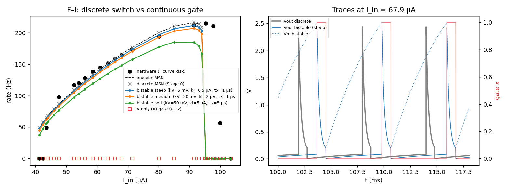

# From a switch to a gate: the MSN as a reduced Hodgkin–Huxley model

**Question.** The MSN ([`msn_neuron.py`](../msn_neuron.py)) fits the hardware
closely ([`experiment_data_compare/REPORT.md`](../experiment_data_compare/REPORT.md):
F–I RMSE ≈ 7 Hz; spike peak and width match at 40 kHz). README §3.4 places it
"between LIF and Hodgkin–Huxley". This report asks two things:

- What exactly separates it from each of those models?
- How can the discrete memristor state `s ∈ {0,1}` become a continuous **gate
  variable**, so that the MSN reads as a *one-channel, simplified HH model*?

**Evidence.** The claims in §3–§5 are checked with a standalone NumPy prototype,
[`gate_proto/proto_gate.py`](gate_proto/proto_gate.py), run on the
hardware-fit parameters
([`configs/neuron_hardware_fit.json`](../configs/neuron_hardware_fit.json):
`Cm = 0.1 µF`, `Ra = 2.2 kΩ`, `Rm_hi = 60.9 kΩ`, `Rm_lo = 53 Ω`, `Vth = 2.50 V`,
`I_hold = 95 µA`). Every number below comes from that run or from `REPORT.md`.
The library code is unchanged.

---

## 1. Three models side by side

| | LIF | MSN (current) | Hodgkin–Huxley |
|---|---|---|---|
| State variables | `V` | `V`, binary `s` | `V`, `m`, `h`, `n` |
| Spike mechanism | threshold rule `V > Vth` | hysteretic switch of a memristive channel | regenerative Na⁺ activation (`m`) |
| Reset | `V ← V_reset` (instantaneous) | none — `V` is continuous; the open channel discharges `C` | none — K⁺ (`n`) and Na⁺ inactivation (`h`) repolarise |
| Refractoriness | explicit `t_ref` | emergent: discharge time `τ_close = Cm(Rm_lo+Ra)` | emergent: slow recovery of `h`, `n` |
| Threshold | hard parameter | hard parameter (`Vth`) on the open→closed switch | soft, emerges from the `m`-gate sigmoid |
| Spike waveform | none | yes; `Vout` matches hardware at 40 kHz | yes |
| F–I onset | log divergence (`f → 0` as `1/ln`) | same log form — `T_charge ∝ ln(...)` (README §6.2) | discontinuous jump (Hopf, type II) for squid parameters |
| Rate ceiling | `1/t_ref` | depolarisation block at `I_hold` (latching) | depolarisation block (Na⁺ inactivation) |
| Channel gating | — | binary, instantaneous, event-driven | continuous, first-order kinetics, V-dependent rates |
| Parameters | 3–4 | 6 (`Cm, Ra, Rm_hi, Rm_lo, Vth, I_hold`) | ~20 |
| Integration | event-driven or coarse `dt` | `dt ≈ 1 µs` + events | `dt ≈ 10 µs`, stiff |

The MSN is **LIF-like** in its subthreshold dynamics, which are a passive linear
RC with a log-onset F–I. It is **HH-like** in how it spikes: a conductance
changes, `V` stays continuous, and refractoriness and the rate ceiling are
emergent. What keeps it from being an HH model is that its only "channel" is
gated by a *discrete event switch*, not by a gate variable with kinetics.

---

## 2. The MSN written in conductance (HH) form

The current model is

$$C_m\dot V = I_{\text{in}} - \frac{V}{R_m(s)+R_a}, \qquad R_m(s) = (1-s)R_m^{\text{hi}} + sR_m^{\text{lo}} .$$

It is *exactly* a single-channel HH membrane:

$$C_m\dot V = I_{\text{in}} - I_M, \qquad I_M = \frac{G_M(s)}{1+R_aG_M(s)}\,(V - E_M), \qquad E_M = 0 .$$

Here $G_M$ is the memristor's own conductance and $R_a$ is a **series access
resistance**. That is the same structure as an HH channel recorded through a
patch pipette with series resistance. For binary `s` it does not matter whether
we interpolate in resistance or in conductance. For a continuous gate it
matters a great deal (§4.2).

Read in HH terms, this form gives three insights:

1. **The memristor is a K⁺-like channel, not a Na⁺-like one.** Its reversal
   potential is ground ($E_M = 0 < V$), so opening it always *repolarises*. The
   upstroke of `V` is done by the input current charging `C`, which is the LIF
   part of the model.
2. **The recorded spike is a channel-current spike.**
   $V_{\text{out}} = I_M R_a$. The "spike" seen on the scope is the channel
   current, so it is the analogue of recording $I_K$, not the membrane voltage.
   `Vm` itself has a sawtooth shape (right panel of the figure in §5).
3. **The positive feedback lives inside the device.** In HH, regeneration
   comes from Na⁺: depolarisation opens `m`, which depolarises further. The MSN
   has no depolarising channel. Its regeneration is the thyristor's internal
   PNPN latch (loop gain → 1), which the current model hides inside the
   instantaneous `s: 0 → 1` switch.

---

## 3. Why a plain HH gate cannot work: a no-go result

The obvious "HH-ification" replaces `s` with a gate $x$ that obeys first-order
kinetics with voltage-dependent steady state:

$$\tau_x\dot x = x_\infty(V) - x, \qquad G_M = G^{\text{lo}} + x\,(G^{\text{hi}} - G^{\text{lo}}) .$$

**This model cannot spike, for any $x_\infty$, $\tau_x$ or input current.**
Write $\dot V = f(V,x)$, $\dot x = g(V,x)$. The divergence of the vector field is

$$\frac{\partial f}{\partial V} + \frac{\partial g}{\partial x} = -\frac{1}{C_m}\frac{\partial I_M}{\partial V} - \frac{1}{\tau_x} < 0 \quad\text{everywhere},$$

because $I_M$ is increasing in $V$. By Bendixson's criterion a planar system
with a divergence of fixed sign has **no periodic orbits**. The trajectory
always settles to a depolarised resting state instead of spiking.

The prototype confirms this: the V-only gate (`vonly`, $k_V = 20$ mV,
$\tau_x = 1$ µs) gives **0 Hz at every current** from 41 to 103 µA.

The general lesson: *a single repolarising channel with HH-style (V-only)
gating is a stable feedback loop.* HH needs Na⁺ for exactly this reason. For
the MSN, the missing positive feedback has to be put **into the gate itself**:
the gate must depend on its own state, as the thyristor latch does.

---

## 4. Integration plan

Each stage is a strict generalisation of the one before. In a stated limit it
reduces *exactly* to the previous stage, so the `REPORT.md` fit is never lost.

### 4.0 Stage 0 — conductance/access-resistance rewrite (no behaviour change)

Rewrite the `Rm_S`/`I_M` subexpressions in `_build_msn_eqs` as in §2 (channel
+ series access resistance, $E_M = 0$).
- **Accept** only if spike trains are identical to the current model.
- **Prototype:** the discrete switch reproduces the analytic F–I to within
  0.0 Hz (column `discrete` vs `analytic`).

### 4.1 Stage 1 — relaxed switch (optional stepping stone)

Keep the `threshold`/`reopen` events, but let them set a *target* $s$ that a
continuous gate follows: $\dot x = (s - x)/\tau_x(s)$.
- This adds finite switching times: $\tau_{\text{on}}$ is bounded by the
  40 kHz rise edge (< 25 µs); $\tau_{\text{off}}$ by the spike tail.
- It is still event-driven, so it is **not** HH-like. Its value is purely as a
  numerical and diagnostic step.

### 4.2 Stage 2 — self-latching bistable gate (the target model)

**Gate equation.**

$$\tau_x\,\dot x = -\,x\,(x-\theta)\,(x-1),\qquad
\theta(V, I_M) = \theta_0 \;-\; a_V\,\sigma\!\left(\frac{V - V_{\text{th}}}{k_V}\right) \;+\; a_I\,\sigma\!\left(\frac{I_{\text{hold}} - I_M}{k_I}\right)$$

with $\sigma$ the logistic function, and
$R_m(x) = (1-x)R_m^{\text{hi}} + xR_m^{\text{lo}}$ (resistance-linear, as in the
current code). The prototype uses $\theta_0 = 0.5$, $a_V = 2$, $a_I = 1$.

**How it works.** The cubic has fixed points at $x = 0$, $x = 1$ and
$x = \theta$. The gate's own dynamics are bistable (the latch), and the circuit
only *moves the separatrix* $\theta$:

| Situation | $\theta$ | Stable states | Meaning |
|---|---:|---|---|
| open, `V < Vth` (charging) | 1.5 | 0 only | stays open |
| `V > Vth` | ≤ −0.5 | 1 only | **breakover → closes** |
| closed, $I_M > I_{\text{hold}}$ | 0.5 | 0 and 1 | **latched** (memory) |
| closed, $I_M < I_{\text{hold}}$ | 1.5 | 0 only | **holding current lost → reopens** |

This is the thyristor's S-shaped I–V written as gate kinetics. Together with
`V` it forms a 2-D relaxation oscillator of the FitzHugh–Nagumo family, which
is the canonical 2-D reduction of HH. The roles are swapped relative to FHN:
here the *gate* is the fast bistable variable and `V` is the slow one.

**Limits and parameters.**
- **Limit:** as $k_V, k_I, \tau_x \to 0$ it reduces to the current MSN.
- **Unchanged meaning:** `Vth` and `I_hold` keep their definitions, so
  `msn_variability.apply_variability` applies unchanged.
- **New parameters:** $k_V$ (threshold softness), $k_I$ (holding softness),
  $\tau_x$ (switching speed). $\theta_0, a_V, a_I$ are structural constants,
  not fit parameters.
- **Regime conditions:** $k_V \ll V_{\text{th}} - V_{\text{hold}}$ and
  $k_I \ll I_{\text{hold}} - I_{\min}$.

**How it departs from strict HH.** The gate's rate depends on $I_M$, and hence
on $x$ itself: this is *cooperative* gating, closer to Ca²⁺-dependent or
ligand-feedback gating than to an independent Markov gate. §3 shows this
departure is *required*, not a modelling convenience.

#### Two designs that were tried and rejected (both kept in the prototype)

| Variant | What happened |
|---|---|
| **First-order gate with OR-combined target**, $x_\infty = 1-(1-\sigma_V)(1-\sigma_I)$ (`or_gate`) | Settles at a **depolarised rest state**. At 67.9 µA: `V = 2.464 V`, `x = 6.9·10⁻⁴`, 36 mV below `Vth`. Fires only in a narrow 91–95 µA window. A smooth V-trigger has a tail, and at steady state $I_M = I_{\text{in}} < I_{\text{hold}}$, so the latch never engages: the §3 no-go comes back locally. |
| **HH rate form**, $\dot x = \alpha(V)(1-x) - \beta(I_M)x$ (`alpha_beta`) | Gate stalls at $x \approx 7\cdot10^{-4}$ and never reaches the spike criterion. |
| **Bistable gate with conductance-linear** $G_M(x)$ (HH convention) | **Silent from 41 to 47.6 µA** (a spurious depolarised rest state, as in the OR-gate), although it tracks the resistance-linear gate above 52 µA: working-range RMSE **31 Hz**. Because $G^{\text{hi}}/G^{\text{lo}} \approx 1150$, the channel is effectively fully closed at $x \sim 1\%$. The gate's state stops meaning anything and the separatrix logic breaks. |

This reverses the recommendation in the original plan. **Interpolate in
resistance, not conductance.** The existing `Rm_S = (1-s)Rm_hi + s·Rm_lo` form is
the right one to keep.

### 4.3 Stage 3 — extensions (optional, after Stage 2 is validated)

- **Channel noise.** Add a Langevin term to $\dot x$ to model near-rheobase
  jitter and device ISI CV. This gives a physical origin for trial-to-trial
  variability, in place of the static `apply_variability` scatter.
- **A slow second gate** $y$, the analogue of the MSBN $R_s, C_s$ compartment
  (README §10.4). A fast latch plus a slow recovery variable is the MSN
  counterpart of HH's fast-`m` / slow-(`h`,`n`) split. It should give
  adaptation and the four bursting modes of Wu et al. 2023 §3.

---

## 5. Prototype results



Working range is 43–93 µA (13 hardware points, as in `REPORT.md`).

| Model | RMSE vs hardware | max \|Δ\| vs analytic MSN |
|---|---:|---:|
| analytic / discrete MSN (current model) | 6.8 Hz | 0.0 Hz |
| bistable steep ($k_V$ = 5 mV, $k_I$ = 0.5 µA, $\tau_x$ = 1 µs) | **7.2 Hz** | 4.6 Hz |
| bistable medium (20 mV, 2 µA, 1 µs) | 8.6 Hz | 9.0 Hz |
| bistable soft (50 mV, 5 µA, 5 µs) | 18.1 Hz | 31.2 Hz |
| bistable medium, *conductance-linear* | 31.2 Hz | 86.9 Hz |
| OR-gate, first-order | 136 Hz | 200 Hz |
| V-only HH gate | 148 Hz (silent) | 216 Hz |

What the prototype shows:

- **The bistable gate converges to the current MSN** as it sharpens. With
  realistic switching (1 µs) it stays within 5 Hz of the discrete model and
  keeps the hardware fit (7.2 vs 6.8 Hz). The `Vout` spike (right panel) keeps
  the discrete model's peak and decay.
- **Softening lowers the rate uniformly.** Soft switching costs a finite time
  at each transition, so the whole curve shifts down.
- **Hypothesis H1 is *not* supported.** I hoped a soft holding criterion would
  cut the log-divergent discharge tail near `I_hold` and reproduce the
  hardware's abrupt cliff (215 → 57 → 0 Hz over 95–103 µA). It does not:
  - every gate variant still loses firing at `I_hold` (95 µA);
  - softer gates roll off *earlier*, not more sharply.

  The cliff is not a gate-smoothness effect. `REPORT.md` §5 attributes it to
  device-specific holding-current behaviour. A gate cannot fix that; a
  holding-current model that depends on `dI/dt` or temperature might.
- **Hypothesis H2 is *untested*.** H2 asks whether a softer threshold fixes the
  near-rheobase residual (hardware 49 Hz vs model 65 Hz at 43.6 µA). The soft
  gate does lower the 43.6 µA point (56 Hz), but only by lowering the whole
  curve. A fair test needs a refit of `Rm_hi` and `Vth` together with $k_V$.

---

## 6. Brian2 implementation sketch (follow-up work)

- **`make_msn(..., gate='discrete' | 'bistable')`** plus an `MSNGateParams`
  dataclass (`k_V`, `k_I`, `tau_x`), following the `MSNParams` JSON pattern.
  `_build_msn_eqs` gains:

  ```python
  dx/dt  = -x*(x - theta)*(x - 1) / tau_x                               : 1
  theta  = 0.5 - 2/(1+exp(-(Vm-Vth)/k_V)) + 1/(1+exp(-(I_hold-I_M)/k_I)) : 1
  Rm_S   = (1 - x)*Rm_hi + x*Rm_lo                                      : ohm
  ```

- **Spikes.** `threshold='x > 0.5'` with `refractory='x > 0.1'`, so the
  closing edge still emits exactly one spike to downstream synapses. The
  `reopen` custom event and the `s` reset are dropped. Synapses and demos are
  untouched, because the spike event keeps its meaning.
- **`x` never sits exactly at 0 or 1.** Both are fixed points of the cubic, so
  `x` needs a floor and ceiling (the prototype clips to [10⁻⁶, 1−10⁻⁶]).
  Otherwise a gate at exactly 0 can never leave it.
- **Integration.** `euler` at `dt ≤ 0.1 µs` for $\tau_x = 1$ µs, which is 10×
  finer than now. Alternatively use $\tau_x \approx 5$–10 µs at `dt = 1 µs`,
  after checking the rate loss (the soft row above shows the cost). Choosing
  $\tau_x$ is the main new cost/accuracy trade-off.

---

## 7. Validation criteria for the implementation

1. **Stage 0:** spike trains identical to the current `make_msn`
   (`demo/ns_msn_if_sweep.py` F–I unchanged to < 0.1 Hz).
2. **Stage 2, keep the `REPORT.md` benchmarks:**
   - working-range F–I RMSE ≤ 7.5 Hz
     (`experiment_data_compare/fit_working_range.py` data);
   - spike peak and FWHM within 2 % of `spike_fit.bin`
     (`experiment_data_compare/fit_spike_hires.py`).
3. **Limit test:** F–I converges to the analytic curve as
   $k_V, k_I, \tau_x \to 0$ (reproduce the §5 table in Brian2).
4. **Refit** $(R_m^{\text{hi}}, V_{\text{th}}, I_{\text{hold}}, k_V)$ jointly to
   settle H2.
5. **Phase-plane figure:** $(V, x)$ nullclines showing the S-shaped gate
   nullcline and the relaxation cycle. This is the figure that makes the
   "reduced HH" claim visual.

---

## 8. Summary

- In HH terms, the MSN is a **single repolarising (K⁺-like) channel** in series
  with an access resistance. The input current charges the membrane, and the
  scope sees the channel current.
- A textbook HH gate on that channel **provably cannot spike** (Bendixson).
  The regenerative feedback that HH gets from Na⁺ must come instead from the
  **gate's own latch**: a bistable, current-dependent gate that encodes the
  thyristor's breakover and holding current.
- That gate (Stage 2) keeps the hardware fit (RMSE 7.2 vs 6.8 Hz), reduces
  exactly to the current MSN in the sharp limit, and keeps `Vth`, `I_hold` and
  the device-variability machinery.
- It does **not** explain the depolarisation-block cliff, which remains a
  device-level holding-current question.

## Appendix — reproducibility

| Script | Produces |
|---|---|
| [`gate_proto/proto_gate.py`](gate_proto/proto_gate.py) | §5 table (stdout) and `gate_proto_fi.png`; ~2 min, NumPy only |

`uv run python docs/gate_proto/proto_gate.py`. Euler integration,
`dt = 0.1 µs`, 150 ms per current, first 30 ms discarded. A current counts as
firing only if it produces ≥ 3 spikes. Hardware F–I values are copied from
`experiment_data_compare/IFcurve.xlsx`.
