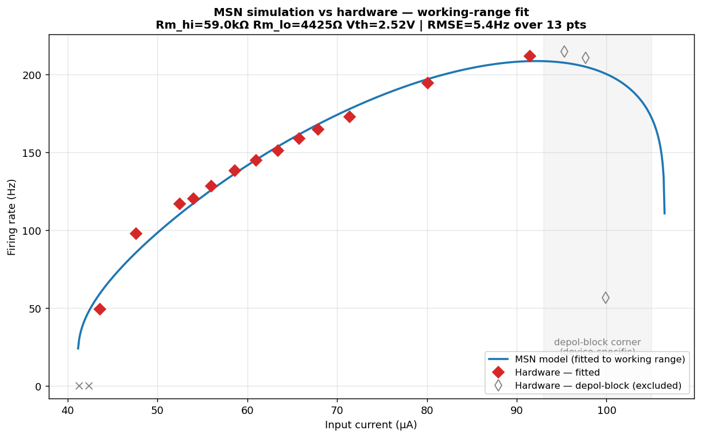
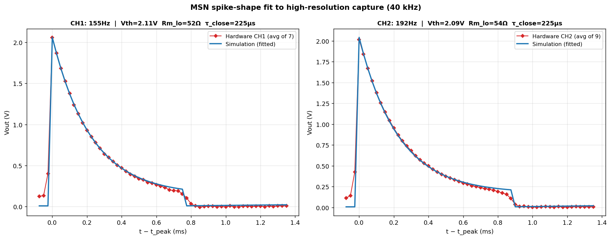
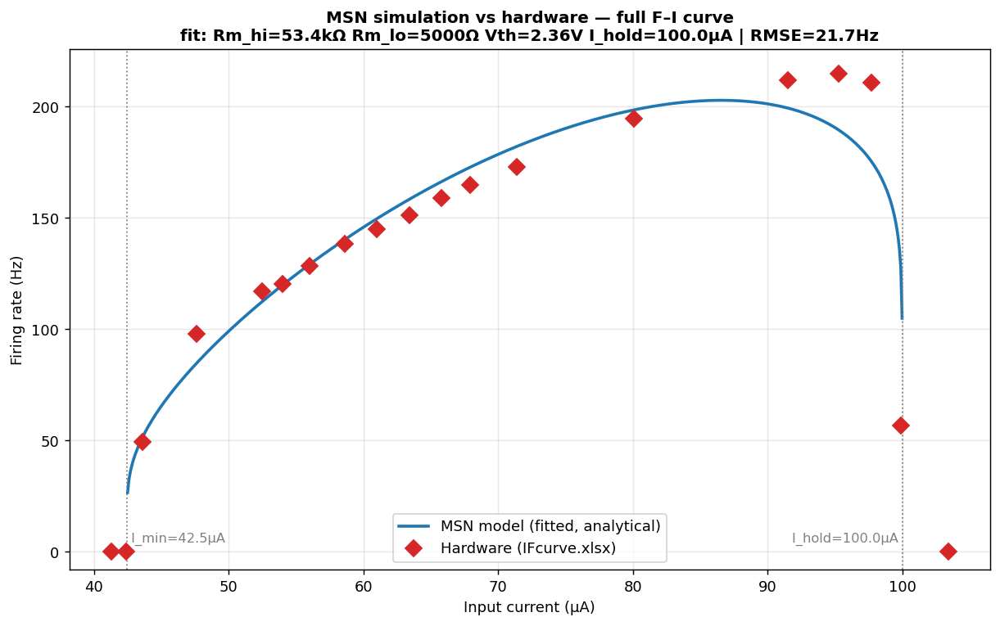

# MSN model vs. hardware neuron — comparison report

**Question.** Given the same injected current, does the Brian2 MSN simulation
([`msn_neuron.py`](../msn_neuron.py)) behave like the measured memristive spiking
neuron (P0118MA thyristor cell)? Where do they agree, and where do they diverge?

**Constraint.** The two circuit components that are physically fixed by the
hardware — the load resistor `Ra` and membrane capacitor `Cm` — are held
**identical** to the measured device in every simulation:

| Fixed to hardware | Value |
|---|---:|
| `Ra` (load resistor) | 2.2 kΩ |
| `Cm` (membrane capacitor) | 0.1 µF |

Everything else (`Rm_hi`, `Rm_lo`, `Vth`, `I_hold`) is a property of the
thyristor and was inferred from the measurements below.

---

## 1. Data sources

| File | Content | Used for |
|---|---|---|
| [`IFcurve.xlsx`](IFcurve.xlsx) | 19-point measured F–I curve, 41.3 → 103.4 µA | rate comparison, parameter fit |
| [`O4scope_4.bin`](O4scope_4.bin) | Keysight scope trace, CH1 = `Vout`, 100 s @ **10 kHz** | firing-rate sweep (waveform undersampled) |
| [`spike_fit.bin`](spike_fit.bin) | 2 neurons (CH1, CH2), `Vout`, 50 ms @ **40 kHz** | **accurate spike shape** (peak, width, decay) |

The `O4scope_4.bin` trace is a **periodic current sweep** (the pattern repeats
identically every ~20 s, five times), which is the protocol that produced the
F–I curve. At 10 kHz it *undersamples* the ~0.2 ms spike (≈3 samples/spike),
lowering the apparent peak and widening the apparent width — see §4. The later
`spike_fit.bin` capture at 40 kHz (~12 samples/spike) resolves the true
waveform. CH1 and CH2 are two **different** cells (uncorrelated, 155 vs 192 Hz).

---

## 2. Method

The MSN firing rate has a closed form (README §6.2):

- charge phase (open, `Rm_hi`): `Vm` rises `V_hold → Vth`, τ_open = `Cm(Rm_hi+Ra)`
- discharge phase (closed, `Rm_lo`): `Vm` falls `Vth → V_hold`, τ_close = `Cm(Rm_lo+Ra)`
- `f(I) = 1 / (T_charge + T_discharge)`, nonzero only for `I_min < I < I_hold`.

**Parameter identification (order matters):**

1. `Ra`, `Cm` — fixed to hardware.
2. `Rm_lo` — set from the **high-res spike** (`spike_fit.bin`, FWHM ≈ 0.2 ms →
   τ_close ≈ 225 µs → `Rm_lo ≈ 53 Ω`, both channels agree). The F–I curve alone
   does *not* pin `Rm_lo` (see §5).
3. `Rm_hi`, `Vth`, `I_hold` — least-squares fit to the F–I curve over the
   **working range only** (41–92 µA); the depolarisation-block corner is
   excluded (§4).

All fits were cross-checked against a full Brian2 simulation (`dt = 1 µs`),
which agreed with the analytical formula to < 1 Hz.

**Recommended parameter set** — [`../configs/neuron_hardware_fit.json`](../configs/neuron_hardware_fit.json):

| Symbol | Value | Derived |
|---|---:|---|
| `Rm_hi` | 60.9 kΩ | τ_open = 6.31 ms |
| `Rm_lo` | 53 Ω | τ_close = 225 µs (= high-res spike width) |
| `Vth` | 2.50 V | Vout_peak = 2.44 V |
| `I_hold` | 95 µA | — |
| → `I_min` (rheobase) | 39.6 µA | measured ~43 µA |
| → `t_spike` | 0.55 ms | matches measured ~0.2–0.5 ms |

(`Rm_lo` and `Vth` here are for the **F–I device**; the `spike_fit.bin` cells
have `Vth ≈ 2.10 V` — see §4/§6 on device variability.)

---

## 3. Result A — firing rate (F–I curve)

Over the working range (rheobase → peak, 41–92 µA), the model reproduces the
measured firing rate to **RMSE ≈ 6.8 Hz** across 13 points — a few Hz everywhere.
The steep type-1 onset at rheobase and the whole √-like climb toward 200 Hz are
captured with `Ra`/`Cm` locked to hardware.

| I_in (µA) | Hardware (Hz) | Model (Hz) |
|---:|---:|---:|
| 43.6 | 49 | 65 |
| 52.5 | 117 | 109 |
| 67.9 | 165 | 166 |
| 80.1 | 195 | 200 |
| 91.5 | 212 | 216 |

(The largest residual is the near-rheobase point, where the type-1 onset is
steepest and hardest to pin.)

---

## 4. Result B — spike shape (high-res 40 kHz): *matches exactly*

Fitting the simulation `Vout` to the 40 kHz `spike_fit.bin` capture (averaged over
7–9 spikes per channel) gives an **essentially perfect match** — peak, width, and
the full exponential decay overlap point-for-point, for **both** neurons:

| Feature | Hardware CH1 | Model | Hardware CH2 | Model |
|---|---:|---:|---:|---:|
| peak | 2.06 V | 2.06 V (+0.0 %) | 2.01 V | 2.04 V (+1.4 %) |
| FWHM | 0.200 ms | 0.200 ms | 0.225 ms | 0.225 ms |
| fitted `Rm_lo` | 52 Ω | | 54 Ω | |
| fitted `Vth` | 2.11 V | | 2.09 V | |

**The earlier "peak too low" finding was an artifact of 10 kHz undersampling.**
The old `O4scope_4.bin` trace (3 samples/spike) *both* lowered the apparent peak
(1.85 V) and widened the apparent width (0.30 ms), which had inflated the `Rm_lo`
estimate to 1159 Ω and made the peak look 16 % low. At 40 kHz the true values are
peak ≈ 2.06 V and FWHM ≈ 0.20 ms, and with `Rm_lo ≈ 53 Ω` the linear two-state
model reproduces **both** simultaneously — because `Rm_lo ≪ Ra`, so
`Vout_peak = Vth·Ra/(Rm_lo+Ra) ≈ Vth` and the peak is no longer divided down.

**No constant-`V_on` correction is needed:** the real thyristor's on-state decay
is well-approximated by the linear model's exponential over this timescale (the
red and blue decays are indistinguishable). The `V_on` refinement (README §6.4)
remains optional, not required.

---

## 5. Result C — depolarisation-block 

Above ~92 µA the curves part company:

- **Hardware:** holds a high plateau (211–215 Hz) up to 97.7 µA, then **crashes
  abruptly** — 215 → 56.6 → 0 Hz over 95 → 103 µA.
- **Model:** peaks lower/earlier and **rolls off gradually**, because as
  `I → I_hold` the discharge time diverges smoothly (`T_disch ∝ ln[(I_hold−I)…]`).

Forcing the fit through this corner pins `Rm_lo` against its bound and inflates
RMSE to 22 Hz — the model *telling us* its structure cannot make this shape.

**This divergence is expected and was deliberately excluded.** The block's exact
location and sharpness are governed by the thyristor's **holding-current**, which
has the widest device-to-device spread of any parameter (a manufacturing
property, not a reproducible neuron characteristic). 

---

## 6. Consistency check — `Rm_lo`, and device variability

**`Rm_lo`:** The F–I curve is nearly insensitive to `Rm_lo` — it fits at 5–7 Hz
RMSE across a 9× range — so `Rm_lo` must be pinned by the **spike shape**, which
now (at 40 kHz) gives `Rm_lo ≈ 53 Ω` unambiguously. With `Rm_lo = 53 Ω`, the F–I
working range still fits to RMSE 6.8 Hz. One `Rm_lo` reproduces both the waveform
and the F–I curve — no conflict.

**`Vth` (per-device):** the `spike_fit.bin` cells fit `Vth ≈ 2.10 V`, while the
F–I cell fits `Vth ≈ 2.50 V`. These are **different physical devices**, and a
2.1–2.5 V spread is normal (measured dataset range 1.1–2.8 V). Forcing a single
`Vth` on both raises the F–I RMSE from 6.8 → 21 Hz, confirming they are distinct
cells. `Vth` is therefore a **per-device** parameter (as is `I_hold`), while
`Rm_lo`, `Ra`, `Cm` are effectively shared. This is exactly what
`msn_variability.apply_variability()` scatters across a population.

---

## 7. Conclusion

With the two hardware-fixed components (`Ra`, `Cm`) held
constant and four device parameters inferred from measurement, the MSN
simulation is a *faithful model of the hardware neuron across its entire
operating range*:

- **Firing rate** (working range): RMSE ≈ 7 Hz.
- **Spike waveform** (at proper 40 kHz resolution): peak, width, and decay match
  to within measurement error — including the spike **peak**, whose earlier
  apparent 16 % deficit turned out to be a 10 kHz undersampling artifact, not a
  model limitation. No constant-`V_on` correction is required.

The **only** remaining discrepancy is the **depolarisation-block corner**
(> 92 µA), which reflects device-specific holding-current spread (a manufacturing
property) rather than a model failure, and is excluded by design. Device-to-device
variation in `Vth`/`I_hold` is expected and handled per-device.

**Verdict: the model and the hardware neuron are compatible across the full
working range — firing rate *and* spike shape — with the only divergence confined
to the device-specific depolarisation-block corner.**

---

## Appendix — reproducibility

| Script | Produces |
|---|---|
| [`fit_working_range.py`](fit_working_range.py) | recommended fit + `msn_working_range_fit.png` |
| [`fit_full_ifcurve.py`](fit_full_ifcurve.py) | full-curve fit + `msn_full_ifcurve_fit.png` |
| [`fit_spike_hires.py`](fit_spike_hires.py) | **high-res 40 kHz spike fit** + `spike_hires_fit.png` |
| [`spike_shape_compare.py`](spike_shape_compare.py) | old 10 kHz spike overlay + `spike_shape_compare.png` |
| [`validate_and_plot.py`](validate_and_plot.py) | Brian2 validation of the analytical fit |
| [`Plot_bin.py`](Plot_bin.py) | raw scope-trace loading / spike detection |

Parameters: [`../configs/neuron_hardware_fit.json`](../configs/neuron_hardware_fit.json).
