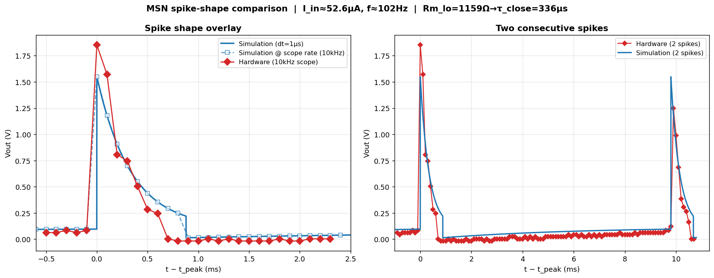

# MSN model vs. hardware neuron — comparison report

**Question.** Given the same injected current, does the Brian2 MSN simulation
([`msn_neuron.py`](../msn_neuron.py)) behave like the measured memristive spiking
neuron (P0118MA thyristor cell)? Where do they agree, and where do they diverge?

**Constraint.** The two circuit components that are physically fixed by the
hardware — the load resistor `Ra` and membrane capacitor `Cm` — are held
**identical** to the measured device in every simulation:

| Fixed to hardware | Value |
|---|---:|
| `Ra` (load resistor) | 2.2 kΩ |
| `Cm` (membrane capacitor) | 0.1 µF |

Everything else (`Rm_hi`, `Rm_lo`, `Vth`, `I_hold`) is a property of the
thyristor and was inferred from the measurements below.

---

## 1. Data sources

| File | Content | Used for |
|---|---|---|
| [`IFcurve.xlsx`](IFcurve.xlsx) | 19-point measured F–I curve, 41.3 → 103.4 µA | rate comparison, parameter fit |
| [`O4scope_4.bin`](O4scope_4.bin) | Keysight scope trace, CH1 = `Vout`, 100 s @ 10 kHz | spike shape, spike width, amplitude |

The scope trace is a **periodic current sweep** (the pattern repeats identically
every ~20 s, five times), which is the protocol that produced the F–I curve.

---

## 2. Method

The MSN firing rate has a closed form (README §6.2):

- charge phase (open, `Rm_hi`): `Vm` rises `V_hold → Vth`, τ_open = `Cm(Rm_hi+Ra)`
- discharge phase (closed, `Rm_lo`): `Vm` falls `Vth → V_hold`, τ_close = `Cm(Rm_lo+Ra)`
- `f(I) = 1 / (T_charge + T_discharge)`, nonzero only for `I_min < I < I_hold`.

**Parameter identification (order matters):**

1. `Ra`, `Cm` — fixed to hardware.
2. `Rm_lo` — set from the **spike width** (FWHM ≈ 0.3 ms → τ_close ≈ 336 µs →
   `Rm_lo ≈ 1159 Ω`). The F–I curve alone does *not* pin `Rm_lo` (see §5).
3. `Rm_hi`, `Vth`, `I_hold` — least-squares fit to the F–I curve over the
   **working range only** (41–92 µA); the depolarisation-block corner is
   excluded (§4).

All fits were cross-checked against a full Brian2 simulation (`dt = 1 µs`),
which agreed with the analytical formula to < 1 Hz.

**Recommended parameter set** — [`../configs/neuron_hardware_fit.json`](../configs/neuron_hardware_fit.json):

| Symbol | Value | Derived |
|---|---:|---|
| `Rm_hi` | 56.4 kΩ | τ_open = 5.86 ms |
| `Rm_lo` | 1159 Ω | τ_close = 336 µs (= spike width) |
| `Vth` | 2.39 V | — |
| `I_hold` | 96 µA | — |
| → `I_min` (rheobase) | 40.8 µA | matches measured ~43 µA |
| → `t_spike` | 0.67 ms | matches measured ~0.3–0.5 ms |

---

## 3. Result A — firing rate (F–I curve)


Over the working range (rheobase → peak, 41–92 µA), the model reproduces the
measured firing rate to **RMSE ≈ 5.9 Hz** across 13 points — a few Hz everywhere.
The steep type-1 onset at rheobase and the whole √-like climb toward 200 Hz are
captured with `Ra`/`Cm` locked to hardware.

| I_in (µA) | Hardware (Hz) | Model (Hz) |
|---:|---:|---:|
| 43.6 | 49 | 60 |
| 52.5 | 117 | 111 |
| 67.9 | 165 | 168 |
| 80.1 | 195 | 197 |
| 91.5 | 212 | 209 |

---

## 4. Result B — spike shape: *width matches, peak ~16 % low*



The **decay** — which sets spike width and the emergent refractory period —
overlaps the hardware trace almost exactly:

| Feature | Hardware | Model |
|---|---:|---:|
| FWHM | 0.30 ms | 0.26 ms |
| decay curve (0.2–0.8 ms) | \|— matching —\| | |
| **peak amplitude** | **1.85 V** | **1.55 V** |

The one gap is the spike **peak**. In the model, `Rm_lo` sets both the width and
the peak simultaneously:

```
width :  τ_close   = Cm·(Rm_lo + Ra)
peak  :  Vout_peak = Vth · Ra/(Rm_lo + Ra)
```

The `Rm_lo` that gives the right *width* divides the *peak* down to 1.55 V. The
two cannot be matched independently with a single linear `Rm_lo`. (The hardware
1.85 V is itself undersampled by the 10 kHz scope, so the true gap is a little
larger.) **Root cause & fix:** a real thyristor on-state is a near-constant
forward drop `V_on ≈ 0.65 V`, not a linear resistor (README §6.4); replacing the
linear `Rm_lo` with `V_M = V_on + I_M·Rm_lo` would decouple peak from width.

---

## 5. Result C — depolarisation-block 


Above ~92 µA the curves part company:

- **Hardware:** holds a high plateau (211–215 Hz) up to 97.7 µA, then **crashes
  abruptly** — 215 → 56.6 → 0 Hz over 95 → 103 µA.
- **Model:** peaks lower/earlier and **rolls off gradually**, because as
  `I → I_hold` the discharge time diverges smoothly (`T_disch ∝ ln[(I_hold−I)…]`).

Forcing the fit through this corner pins `Rm_lo` against its bound and inflates
RMSE to 22 Hz — the model *telling us* its structure cannot make this shape.

**This divergence is expected and was deliberately excluded.** The block's exact
location and sharpness are governed by the thyristor's **holding-current**, which
has the widest device-to-device spread of any parameter (a manufacturing
property, not a reproducible neuron characteristic). 

---

## 6. Consistency check — one parameter set, two measurements

The F–I curve is nearly insensitive to `Rm_lo`: fitting with `Rm_lo` free (4425 Ω)
gives RMSE 5.4 Hz; pinning `Rm_lo = 1159 Ω` from the *spike width* gives 5.9 Hz —
essentially identical.

| `Rm_lo` fixed at | τ_close | F–I RMSE |
|---:|---:|---:|
| 500 Ω | 270 µs | 6.3 Hz |
| **1159 Ω (spike width)** | **336 µs** | **5.9 Hz** |
| 4425 Ω (free fit) | 662 µs | 5.4 Hz |

So there is **no conflict**: a single, physically-consistent parameter set
reproduces both the spike waveform *and* the F–I curve. `Rm_lo` should be pinned
by the spike width.

---

## 7. Conclusion

With the two hardware-fixed components (`Ra`, `Cm`) held
constant and four device parameters inferred from measurement, the MSN
simulation is a *faithful model of the hardware neuron across its entire
operating range* — firing rate to a few Hz and spike width to tens of µs. The
only material discrepancies are (1) a ~16 % spike-peak deficit, a known
consequence of the linear two-state resistor, and (2) the depolarisation-block
corner, which reflects device-specific manufacturing spread rather than a model
failure. Both are understood, and (1) has a clear one-line remedy if higher
waveform fidelity is ever required.

---

## Appendix — reproducibility

| Script | Produces |
|---|---|
| [`fit_working_range.py`](fit_working_range.py) | recommended fit + `msn_working_range_fit.png` |
| [`fit_full_ifcurve.py`](fit_full_ifcurve.py) | full-curve fit + `msn_full_ifcurve_fit.png` |
| [`spike_shape_compare.py`](spike_shape_compare.py) | `spike_shape_compare.png` |
| [`validate_and_plot.py`](validate_and_plot.py) | Brian2 validation of the analytical fit |
| [`Plot_bin.py`](Plot_bin.py) | raw scope-trace loading / spike detection |

Parameters: [`../configs/neuron_hardware_fit.json`](../configs/neuron_hardware_fit.json).
